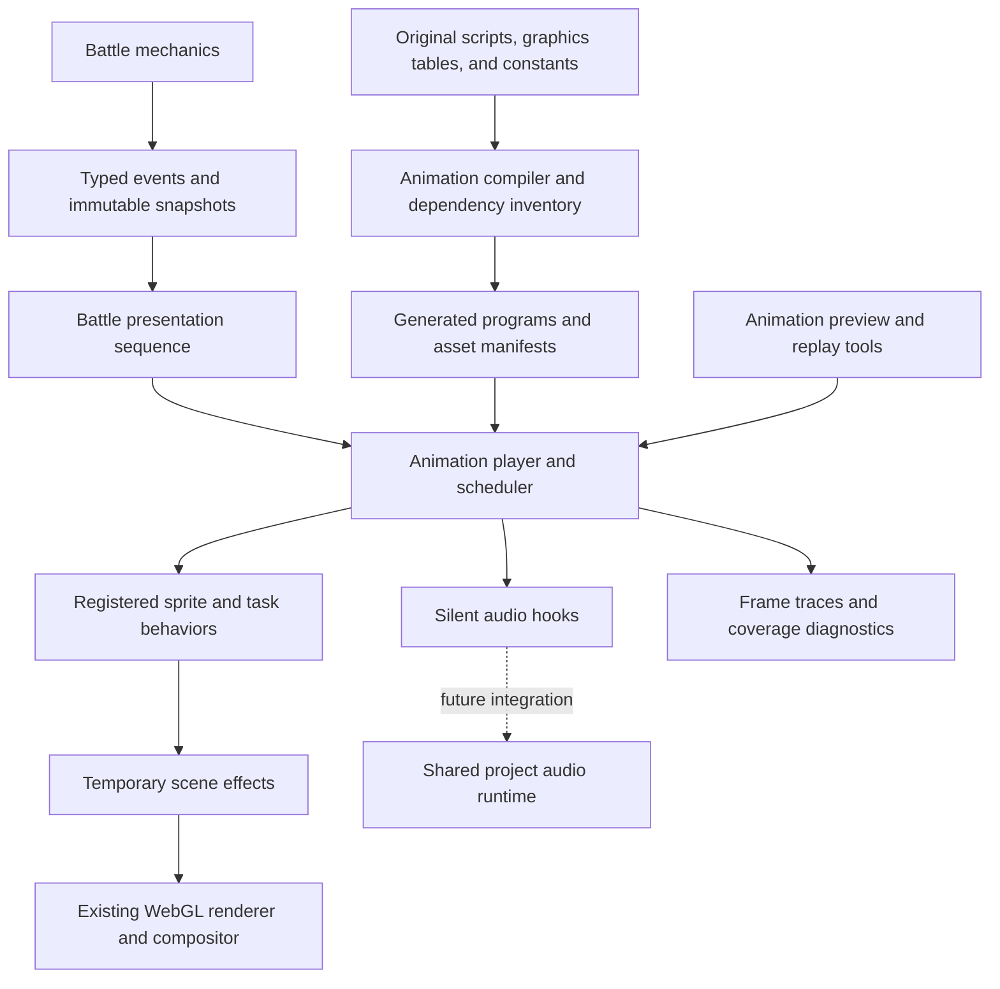

# Scalable battle animation implementation plan

Build a reusable player for Emerald's animation scripts, backed by the existing WebGL renderer. M0–M3 are implemented: the eight starter moves and Gardevoir's configured Psychic, Calm Mind, Thunderbolt, and Shadow Ball now run in live single battles and the isolated preview. This also introduces part of M5's background/palette capabilities; the full M5 milestone remains open. See [docs/features/battle/animation-expanded-moves.md](./animation-expanded-moves.md) for current coverage, validation, and timing limitations, and [docs/features/battle/animation-first-slice.md](./animation-first-slice.md) for the initial M0–M2 snapshot. Audio remains deferred.

## Related

- [docs/features/battle/06-animation-system.md](./06-animation-system.md)
- [docs/features/battle/09-battle-animations.md](./09-battle-animations.md)
- [docs/features/battle/rendering-pass-2026-09-14.md](./rendering-pass-2026-09-14.md)
- [docs/features/battle/06-battle-flow.md](./06-battle-flow.md)

## Scope and decisions

- Target faithful Emerald timing, positioning, layering, and visual appearance. Use original choreography and distinctive sprite artwork, with procedural drawing or shaders where they reproduce the visible effect economically.
- Deliver single battles first. Identify battlers by stable slots and resolve attacker/target/partner roles through one interface, so the animation architecture can later support doubles. Doubles gameplay, contest playback, and link synchronization are separate milestones.
- Keep battle mechanics authoritative and independent of playback. Animations consume recorded outcomes; they never calculate damage, consume PP, roll battle RNG, or write saves.
- Use the existing saved `battleScene` option. Disabling move animations preserves messages, HP updates, outcomes, and required transitions.
- Preserve sound commands through lightweight, silent hooks from the beginning. Actual playback, audio asset conversion, and browser audio integration are deferred until the project has broader audio support; none blocks the visual milestones. Report visual and audio coverage separately.
- New behavior lives in focused animation/presentation modules. `BattleState.ts` remains the state adapter rather than accumulating per-move cases.

## Verified starting point (before M0)

| Area | Current state | Consequence |
|---|---|---|
| Rendering | `BattleWebGLContext` renders at 240×160. `WebGLSpriteRenderer` already supports rotation, scaling, alpha, tint, and flipping. | Reuse this renderer and `SpriteInstance`; add effect composition capabilities where required. |
| Battle UI | Corrected healthboxes, sprites, fonts, and menus; isolated `#/battle-render` fixtures. | Keep this as the rendering baseline and extend the preview tooling. |
| Move effects | `BattleState` selects coloured flashes for six moves, with a generic fallback, when damage events start. | Replace this path progressively. Successful support moves need explicit animation events too. |
| Turn presentation | `executePlayerAction` resolves and persists mechanics before displaying queued messages. Empty message entries run callbacks and advance immediately. | Introduce explicit presentation steps and completion barriers; presentation must retain historical display state. |
| Animation data | `generate-battle-animations.cjs` emits root script blocks as strings; there are no playback imports of its output. Called helpers such as `RoarEffect` are omitted. | Expand the generator into a validated compiler before relying on its output. |
| Existing script runtime | `battle/engine/scriptRuntime/BattleScriptRuntime.ts` is a mechanics scaffold with a different command set. | Reuse registry/coverage conventions, while keeping animation execution separate. |
| Existing animation managers | `AnimationTimer` and `WebGLAnimationManager` handle tilesets. | Reuse timing constants and appropriate asset helpers; these managers do not implement move choreography. |
| Audio | `ScriptRunner` explicitly treats sound commands as no-ops pending an audio system. | Define silent cue/completion hooks now; defer playback and asset investigation to the later project audio integration. |
| Data verification | Battle animations are generated separately and absent from `battle-data-manifest.cjs`. | Register animation outputs with the existing generation and verification workflow. |

The original interpreter defines 48 commands. A direct inventory of `battle_anim_scripts.s` references 329 sprite templates and 211 distinct functions through `createvisualtask`. These are reference counts, not counts of independent implementations: callbacks are reused and can create additional effects internally. The full dependency inventory must include those children.

The first eight moves—Tackle, Growl, Pound, Scratch, Tail Whip, Ember, Water Gun, and Absorb—directly reference approximately 12 sprite templates and five visual-task functions after following simple calls/gotos. This is a useful small starting set, not a complete transitive implementation estimate.

## Architecture and ownership

| Module | Responsibility |
|---|---|
| Generator + generated data | Parse scripts/constants/tables; resolve control flow and assets; produce typed programs, source locations, dependencies, and coverage inputs. |
| `battle/animation/runtime/` | Program counter, call stack, argument registers, fixed-step clock, task scheduling, waits, cancellation, and completion. No DOM or WebGL dependencies. |
| `battle/animation/effects/` | Ported sprite callbacks and task state machines, grouped by shared behavior and then effect family. |
| `battle/animation/scene/` | Battler anchors, pose contributions, palette/blend groups, background effects, resource ownership, and `SpriteInstance` output. |
| `battle/animation/assets/` | Resolve tags/templates, prepare frames, load declared dependencies, cache textures, and release references. |
| `battle/animation/audio/` | Minimal cue/completion interface and silent adapter. Preserve sound IDs and command metadata for a future shared audio backend. |
| `battle/presentation/` | Convert battle events into ordered message, animation, HP, status, faint, and transition steps. Own displayed snapshots. |
| Debug page + reports | Run the same player with deterministic inputs; inspect frames, traces, missing capabilities, and performance. |

Create these modules as their responsibilities become necessary; the directory layout is a boundary, not a requirement to scaffold empty abstractions. Reuse `assetLoader`, indexed transparency, `gbaTilemap`, species coordinates, `PromptController`, `PromptCanvasRenderer`, `InputMap`, and the existing rendering types.

### Runtime contracts

An animation request identifies its script domain (`move`, `status`, `general`, or `special`), entry ID, attacker/target slots, resolved battler identities, and an immutable context snapshot. Context includes only required branch inputs: move phase, hit index, damage/power where referenced, friendship, terrain, side, and an animation-only seed.

`AnimationPlayer.start(request)` returns a handle with `loading`, `running`, and terminal states (`completed`, `skipped`, `cancelled`, `failed`). `advance(deltaMs)`, `stepFrame()`, `cancel(reason)`, and a render snapshot/command writer are the core integration surface. Every handle settles exactly once, including asset failures, battle exit, and interrupted playback.

Each active animation owns its particles, tasks, transforms, visibility changes, palette overrides, background overrides, asset references, and audio handles. End, skip, error, and cancellation converge on one cleanup path. Persistent gameplay visibility, such as a Pokémon remaining underground between turns, belongs to presentation state and is handed back explicitly rather than left as an orphaned animation override.

## Data import and coverage

Extend the existing generator rather than maintaining a second manually authored move table.

1. Parse the source into an instruction stream with a label-to-address table. Preserve aliases, empty labels, and fallthrough; splitting the file into independent root blocks is insufficient.
2. Resolve calls, returns, jumps, conditional branches, and two-turn branches. Traverse reachable paths, including fallthrough, to build each entry's dependency closure. Include helper labels and all four entry tables.
3. Resolve constants and permitted expressions with a small explicit parser: signed values, arithmetic/bit operations, and used macros such as `RGB(...)`. Unsupported expressions produce source-located build errors. Do not use JavaScript `eval`.
4. Import sprite template metadata, frame animation tables, affine tables, graphics/palette tags, and background tables from the C definitions. Preserve frame offsets, dimensions, pivots, loop/jump commands, and indexed transparency. Normalize GBA tile/frame layouts once during asset preparation.
5. Register handwritten behavior ports by their original C symbol. A behavior declares additional templates, tasks, or assets it can create. Include these transitive children in preflight and coverage, even when no script directly mentions them.
6. Emit typed instructions and manifests with stable IDs, source file/line references, and a source revision/hash. Retain human-readable symbol names for diagnostics. Split generated assets/program bundles by shared dependencies when measurements justify it.

Coverage must distinguish **imported**, **executable**, **visually verified**, and **audio verified**. Track unsupported commands, templates, callbacks, affine operations, assets, and branch contexts independently. A known root script is not sufficient to mark a move supported.

With the silent adapter, executable means executable with audio stubbed. Track audio assets separately from visual dependencies: missing audio files or a playback backend do not trigger visual fallback or block a visual release. Audio remains explicitly deferred, and any timing that depends on actual sound completion remains unverified until audio integration.

Preflight an entry's applicable dependency closure before playback. During development, unsupported behavior fails the fixture with the source symbol and path. During gameplay, select a documented fallback before starting; unexpected runtime failure releases owned effects and allows the presentation sequence to finish. Fallbacks are classified by move semantics, so a support move does not automatically show a damaging hit. Fallback use is visible in development reports and does not count as authentic coverage.

## Clock, tasks, and scene composition

- Use integer animation frames driven by `GBA_FRAME_MS` from `src/config/timing.ts`. Rendering may run at any refresh rate. Do not change choreography with `setTimeout` or per-particle React state.
- Follow the existing resume threshold and bounded catch-up policy. Pause logical playback on tab suspension; resume without replaying a large wall-clock backlog. A catch-up limit delays simulation rather than silently dropping effect lifecycle events.
- Establish scheduler ordering against the original C before porting callbacks. Cover immediate task initialization, task priority, sprite callback/frame advancement, and destruction order with trace tests. Stable creation IDs resolve equal-priority ordering.
- Preserve command timing even when assets are cached: `loadspritegfx` yields in C. Explicitly test `delay 0`, `delay 1`, creation-frame callbacks, `waitforvisualfinish`, and `end` waiting for remaining work.
- Maintain animation-local argument registers and task/sprite state. Preserve signed integer/fixed-point behavior where callbacks depend on it. Shared register reads remain explicit; copying arguments indiscriminately can change behavior.
- Visual and sound wait groups are distinct. Classification follows the command/lifetime semantics: Growl launches `SoundTask_*` functions through `createvisualtask`, so function names alone cannot determine which wait group they occupy.
- Define role resolution once, including absent partners in singles and GBA coordinate variants. Resolve direction per callback semantics; automatically mirroring every X value would produce incorrect effects.
- Compose temporary pose contributions over the resting pose. Define channels for translation, scale/rotation, visibility, tint/palette, and scene overlays. Additive offsets and priority-based overrides have deterministic rules, so concurrent shake and lunge effects do not overwrite each other.
- Preserve indexed palette semantics when needed. Tint alone cannot reproduce selective palette cycling. Use bounded cached variants or a palette-aware shader capability when a supported effect requires it.
- Model `monbg`, alpha coefficients, priority splitting, and masks as explicit render groups. GBA blending is not always equivalent to ordinary sprite alpha. Implement the required visible behavior and track approximations rather than silently treating commands as no-ops.
- Keep the HUD/message layer outside battlefield effects unless the source effect intentionally targets it. Preserve the corrected battle-window composition.

The interpreter has instruction and stack limits; tasks have bounded ownership and diagnostic lifetime checks. A corrupt script, pool exhaustion, missing dependency, or callback failure must not leave the battle waiting indefinitely.

## Battle-flow integration

The first integration must solve ordering, not just start effects alongside messages.

1. Add typed presentation metadata/events at the actual move-execution points. Include action/event identity, attacker, target, move/phase, relevant branch values, and before/after display values. Do not infer attacks by parsing message strings or assume every damage event is a new move.
2. Preserve the current synchronous mechanics resolution and persistence. Capture immutable presentation inputs before later engine mutations can overwrite the state needed for an earlier animation. Associate battler slots with the active party identity so queued effects cannot attach to a replacement Pokémon.
3. Introduce explicit sequence steps: message, play animation, wait for animation, HP transition, status/stat presentation, faint, and battle/menu transition. Messages use the existing prompt system. Empty text is no longer the mechanism for controlling animation waits.
4. Match each supported move's ordering to `attackanimation`, `waitanimation`, and health-bar commands in the original battle scripts. The default damaging path waits at those boundaries; move-specific overlap requires an explicit presentation rule.
5. Handle successful support moves, misses, protection, immunity, multi-hit moves, charge/release, delayed damage, healing/drain, recoil, and end-of-turn status independently. Supply engine outcomes to playback; animation RNG never affects mechanics RNG.
6. Advance displayed HP/status snapshots at the appropriate step. Do not reveal final turn state immediately after `syncFromEngine`, and never apply a damage delta twice because both animation completion and a message callback fired.
7. Keep menus blocked while required presentation steps run. A/B retains mapped text controls and cannot accidentally skip an animation barrier. Respect the saved `battleScene` option. Any future user-facing speed control must also use shared input mapping and preserve logical frame order.
8. Cancel presentation cleanly on exit, forced replacement, run/capture outcome, or renderer disposal. Skip/disabled-animation paths complete all necessary presentation state changes without re-running mechanics.

Preserve the existing save format. Animation state is temporary; the existing `battleScene` preference already has a persistent representation. Compare mechanics event streams and final saves before and after integration to detect unintended changes.

## Audio hooks now; playback deferred

The visual implementation only needs an injected interface for effect/cry cues, pan/volume updates, stop requests, and completion handles. The default `SilentAnimationAudio` adapter does no playback or asset loading. It can record cue IDs, logical frames, pan, repetitions, and BGM ducking requests for debug traces. Add methods only as imported commands require them; do not build a separate battle audio engine.

Keep script delays and explicitly scheduled sound-task intervals on the normal animation clock. The silent adapter reports individual playback handles as completed when the scheduler next checks them, so waits for an unavailable sound/cry cannot hang. Preserve task creation, wait-group membership, and cleanup, including Growl's sound tasks launched through `createvisualtask`. Only playback is stubbed; callbacks that also change visual or script state still need their behavior ported. Do not invent clip lengths. Fixtures flag sound-completion-dependent timing as provisional, while still verifying visual movement and explicit script delays.

After the shared project audio runtime is available, implement the same interface using that runtime. Audio asset investigation and conversion begin in the deferred milestone, with one impact SFX and one Pokémon cry proving the path first. Reuse the project's chosen decoding/synthesis and asset pipeline rather than assuming a second implementation is needed for battles.

That later integration owns autoplay/unlock, pan, duration, cry behavior, suspension, playback speed, and cancellation through the shared backend. Replace silent completion with real completion signals, then reverify sound-dependent timing and audio coverage. Imported scripts and battle sequencing retain the same interface. Until then, no audio-conversion spike, Web Audio setup, or audio asset delivery is required by M0–M6.

## Delivery milestones

| Milestone | Deliverable | Completion gate |
|---|---|---|
| **M0 — Inventory and contracts** | Script/dependency report with unresolved callback children flagged; typed program schema; starter capability manifest; presentation event and silent audio hook contracts; baseline profiling. | Every root is indexed; missing helpers/aliases/constants are diagnosed; first eight moves have an explicit visual dependency list; audio references are recorded as deferred; baseline device/browser is recorded. |
| **M1 — Runtime with Tackle** | Compiler for required operations, scheduler, resource scopes, asset/frame preparation, lunge/hit/shake behaviors, silent audio adapter, preview replay and frame stepping. | Tackle runs from the imported script on either side without an audio backend; timing traces cover waits/cleanup and silent cue completion; no leaked pose or particle after replay, skip, failure, or cancellation. |
| **M2 — Real battle sequencing** | Typed animation events and presentation sequence; Tackle and Growl in live battles; saved animation toggle. | Damage and support paths both play correctly; Growl imports `RoarEffect` and completes sound-related waits with the silent adapter; rapid A/B does not race; HP/messages stay ordered; mechanics results and saves remain unchanged. |
| **M3 — First complete visual set** | Add Pound, Scratch, Tail Whip, Ember, Water Gun, and Absorb; implement shared frame/affine, projectile, droplet, palette, drain, and healing behavior as needed. | All eight moves pass both attacker sides, species-anchor cases, repeat playback, option-off, and cleanup checks; visual choreography is checked against original references, with sound-completion-dependent timing explicitly provisional. |
| **M4 — Common support effects** | Common stat/status/heal visuals routed through the shared player, with sound cues continuing through the silent hooks. | Shared support effects pass visual and cleanup checks; status/weather ownership does not conflict with active moves; no dependency on audio playback. |
| **M5 — Advanced capabilities** | Add high-reuse background/mask/distortion effects and contextual branches. Candidate proving moves: Thunderbolt, Surf, Psychic, Earthquake, Fly/Dig, and a multi-hit move. | Each capability has targeted visual, lifetime, ordering, and performance evidence. Branches and callbacks created dynamically appear in coverage. |
| **M6 — Systematic expansion** | Rank remaining dependencies by the number of moves they unlock; expand batches; migrate older send-out/capture/faint effects where reuse is useful. | Published per-move visual coverage, deferred audio status, regression fixtures, and supported-context lists. Full single-battle visual coverage requires all applicable branches, with provisional sound-dependent timing tracked separately. |
| **M7 — Deferred audio integration** | Once broader project audio support exists, connect the hooks to it; prove SFX/cry assets; add real playback/completion and verify cue behavior. | First eight moves pass sound/cry timing, pan, cancellation, and muted/unavailable-backend checks; sound-dependent visual timing is reverified; expand audio coverage separately. |

M0 → M1 → M2 is the first implementation slice. It ends with two representative moves playing in real battles and a foundation proven by both a damaging and a support move. Reassess the remaining workload from measured callback effort after M3. Full coverage is a sustained content-porting effort; exact hours are not established by this plan.

M0–M6 proceed with the silent adapter. M7 is a separate integration track triggered by broader project audio readiness; it neither blocks visual expansion nor requires waiting for every move's visuals to be finished.

## Browser efficiency and validation

Load the shared effects bundle and the current battlers' reachable visual move dependencies before playback. Load additional bundles when moves or battlers change. Decode PNGs, resolve palettes/frames, and upload textures outside the frame loop. Keep preload failure/loading states explicit; simulation does not partially start while a required visual asset is still loading. The silent adapter never requests audio assets.

Reuse bounded sprite/task storage and instance buffers. Render only live effects, batch compatible textures/materials while preserving layer order, and allocate offscreen effect targets only when required. Start with explicit configurable resource limits and report peaks; choose final limits from the dependency inventory and stress fixtures. Release animation-owned references on completion and battle-owned GPU resources on exit. Share immutable assets through bounded caches.

Initial performance targets, to validate rather than assume:

- Sustain the animation's native cadence on the recorded baseline browser/device with the full battle UI visible.
- Aim for less than 2 ms p95 CPU work for animation update/command generation in representative scenes; measure total frame time, compositor cost, draw calls, texture uploads, and active counts separately.
- No recurring image decoding, texture re-uploads of unchanged artwork, or per-particle React renders during playback.
- A repeated-playback stress test (at least 100 runs after warm-up) returns active sprites/tasks/overrides/references to baseline and shows no monotonic resource growth.
- Test different render rates, large incoming deltas, tab hide/resume, and both small and enlarged viewport presentations. Do not reduce logical animation steps to hide performance problems.

Tests and review evidence:

| Layer | Required checks |
|---|---|
| Generator | Root tables, helper closure, aliases/fallthrough, conditional targets, expression parsing, frame/affine commands, asset resolution, deterministic output. |
| Headless runtime | Frame-exact delays, load yields, task initialization/priority, shared arguments, call/return/branching, waits, pool limits, silent cue/completion behavior, terminal-state and cleanup guarantees. Real audio timing is deferred to M7. |
| Effects | Known-frame positions/transforms and sprite frames from C; attacker-side changes; seeded particle replay; nested effects and ownership. |
| Integration | Damaging and support moves, failure paths, HP/drain/faint ordering, multi-hit/charge/release, rapid input, animation option off, battle exit, save/mechanics invariance. |
| Visual | Deterministic captures at named frames with original reference captures where available; compare anchors, timing, silhouettes, layers, blending, and transparent edges. Mark unreviewed effects explicitly. |
| Performance | Frame-time distributions and active/resource counts, preload behavior, repeated playback, context disposal/recovery policy. |

Extend `#/battle-render` with an animation mode (or a linked `#/battle-animations` page if controls become crowded). Provide move/species/side selection, seeded replay, pause, one-frame stepping, playback speed, reference comparison, and active effect/source diagnostics. Scrubbing initially resets and deterministically replays to the requested frame; do not attempt to rewind arbitrary mutable callbacks. These controls operate on isolated fixtures and never write saves.

## Implementation checklist

- [x] M0: Extend inventory/compiler design, record visual dependencies, and define silent audio hooks.
- [x] M1: Run imported Tackle with deterministic playback, silent hooks, and cleanup.
- [x] M2: Integrate Tackle and Growl into ordered live battle presentation.
- [x] M3: Finish and visually review the eight-move starter set against source choreography; emulator timing comparison remains unverified.
- [ ] M4: Implement and verify common support visuals with silent audio hooks.
- [ ] M5: Add advanced composition and contextual branch support.
- [ ] M6: Expand from dependency coverage until the agreed single-battle target is met.
- [ ] M7 (deferred): Connect to broader project audio support and verify sound assets, cues, and sound-dependent timing.

For each move batch: declare dependencies → port missing shared behavior → run headless/visual fixtures → integrate/replay in battle → update coverage and this checklist. A move should normally require generated data plus registered shared behavior, not a new branch in `BattleState`.

## Primary source references

- `public/pokeemerald/data/battle_anim_scripts.s` and `public/pokeemerald/asm/macros/battle_anim_script.inc`: scripts, control flow, and command encodings.
- `public/pokeemerald/src/battle_anim.c`: interpreter timing, resource lifetime, arguments, blending, and audio waits.
- `public/pokeemerald/src/data/battle_anim.h`: graphics/palette/background tables and OAM definitions.
- `public/pokeemerald/src/battle_anim_*.c`: sprite callbacks, task behavior, movement, and sound tasks.
- `public/pokeemerald/src/battle_script_commands.c` and `public/pokeemerald/data/battle_scripts_1.s`: animation versus damage/message ordering.
- `public/pokeemerald/src/battle_anim_mons.c`, `public/pokeemerald/src/sprite.c`, and `public/pokeemerald/src/task.c`: anchors, frame/affine animation, and scheduler semantics to audit during M1.
- `public/pokeemerald/sound/` and `public/pokeemerald/include/constants/songs.h`: identifiers to preserve now; SFX/cry asset inputs to investigate during deferred M7.
